# IARA Chat

## Sumário

- [Introdução](#introdução)
- [Acesso ao Sistema](#acesso-ao-sistema)
- [Configuração Inicial](#configuração-inicial)
  - [3.1. Criando uma Fila de Atendimento](#31-criando-uma-fila-de-atendimento)
  - [3.2. Configurando a Conexão com WhatsApp](#32-configurando-a-conexão-com-whatsapp)
  - [3.3. Vinculando Usuários às Filas](#33-vinculando-usuários-às-filas)
  - [3.4. Atendimento Compartilhado (Múltiplos Atendentes)](#34-atendimento-compartilhado-múltiplos-atendentes)
- [Utilizando o Sistema de Atendimento](#utilizando-o-sistema-de-atendimento)
  - [4.1. Navegação pela Interface](#41-navegação-pela-interface)
  - [4.2. Gerenciando Conversas](#42-gerenciando-conversas)
  - [4.3. Funcionalidades da Conversa](#43-funcionalidades-da-conversa)
- [Gerenciamento de Contatos](#gerenciamento-de-contatos)
  - [5.1. Visualizando Informações do Contato](#51-visualizando-informações-do-contato)
  - [5.2. Editando e Vinculando Empresas](#52-editando-e-vinculando-empresas)
- [Visualização Kanban](#visualização-kanban)
- [Dúvidas Frequentes](#dúvidas-frequentes)
- [Boas Práticas de Atendimento](#boas-práticas-de-atendimento)
- [Suporte Técnico](#suporte-técnico)

## Documentação Funcional

**Versão 1.0 | Data: 05/11/2025 | Elaborado por: Luís Fachin**

---

## Introdução

Bem-vindo ao **IARA Chat**! Este é o sistema de atendimento integrado que permite gerenciar conversas via WhatsApp de forma profissional e organizada.

Este manual foi desenvolvido para guiá-lo passo a passo na utilização da plataforma, desde a configuração inicial até o atendimento diário de clientes.

---

## Acesso ao Sistema

**Link de Acesso:** [IARA Chat](https://chat.iara.tech)

**Credenciais:** Utilize o mesmo usuário e senha do sistema IARA principal.

:::warning Importante
Caso não consiga acessar o sistema, entre em contato com o suporte técnico via Microsoft Teams: **luis.fachin@iara.tech**
:::

---

## Configuração Inicial

### 3.1. Criando uma Fila de Atendimento

As filas de atendimento organizam as conversas por vendedor, região ou departamento. Siga os passos abaixo:

**Passo 1:** Acesse o menu lateral e clique em **"Filas e Chatbot"**
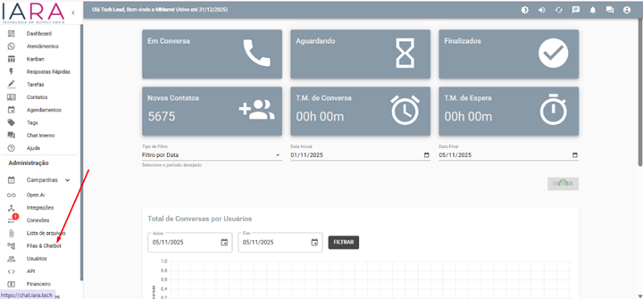

**Passo 2:** Clique no botão **"Adicionar Fila"**
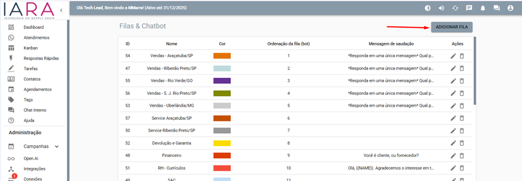

**Passo 3:** Preencha os dados da fila seguindo o padrão:

**Nome da Fila:**
```
(Estado/Cidade) - Nome do Vendedor [Código]
```

**Exemplo:**
```
(SP/RP) - Luis Fachin [1234]
```
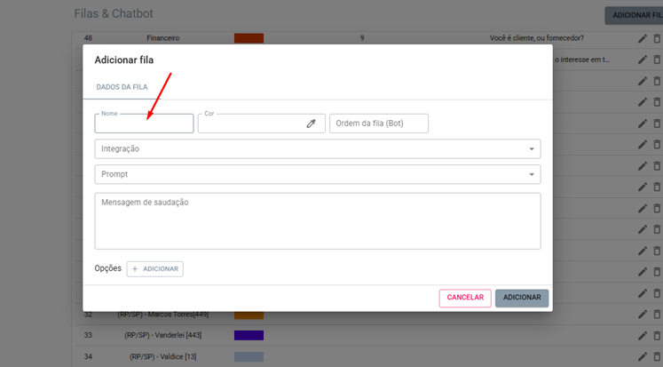

**Passo 4:** Escolha uma cor identificadora para a fila

:::tip Dica
Selecione uma cor que ainda não esteja sendo utilizada por outras filas.
:::
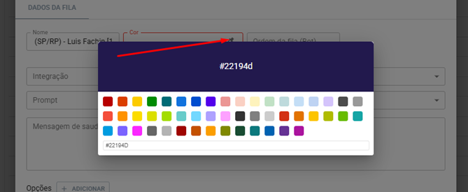

**Passo 5:** Clique em **"Salvar"**
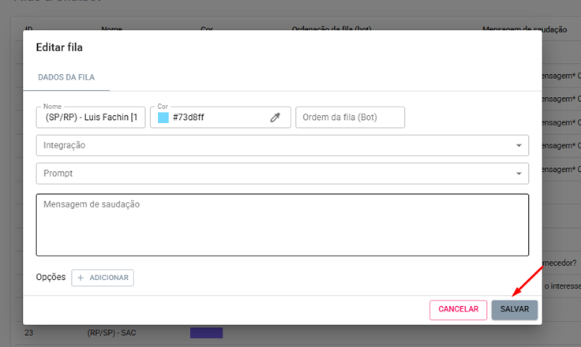
---

### 3.2. Configurando a Conexão com WhatsApp

Após criar a fila, é necessário conectá-la a um número de WhatsApp.

**Passo 1:** No menu lateral, acesse **"Conexões"**
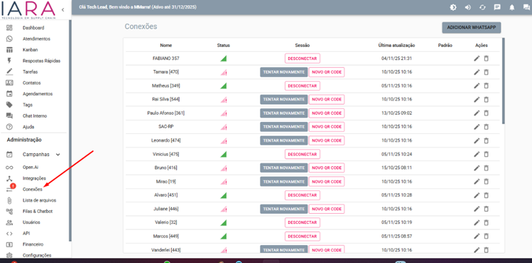

**Passo 2:** Clique em **"Adicionar WhatsApp"**
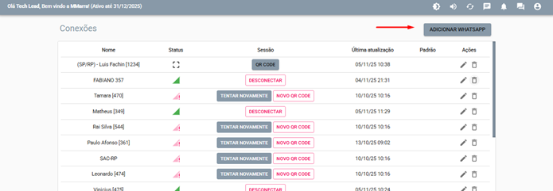

**Passo 3:** Preencha as informações:

- **Nome:** Utilize o mesmo padrão da fila criada anteriormente
- **Fila:** Selecione a fila que você acabou de criar


**Passo 4:** Após preencher os dados, pressione **ESC** ou clique fora da janela para confirmar a seleção da fila
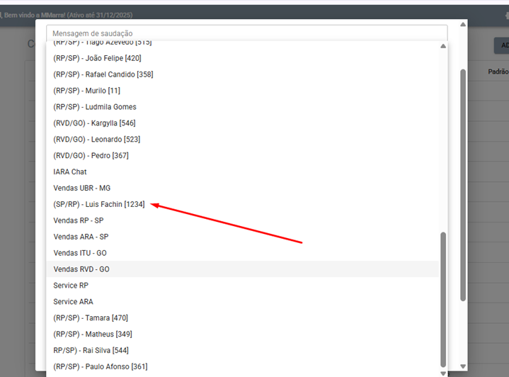

**Passo 5:** Clique em **"Adicionar"**
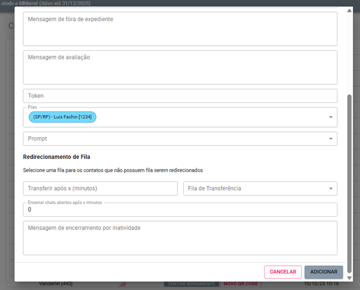

**Passo 6:** Na lista de conexões, clique no botão **"QR CODE"** ao lado da conexão criada
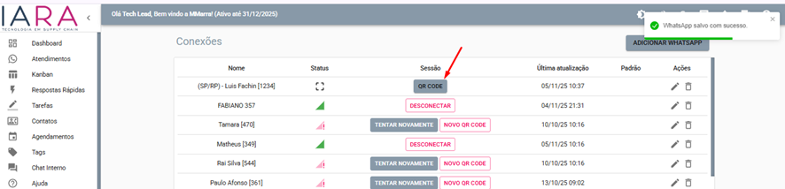

**Passo 7:** Abra o WhatsApp no seu celular e escaneie o QR Code:
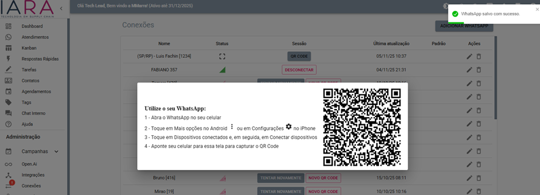

- Abra o WhatsApp
- Toque em **"Mais opções"** (⋮) ou **"Configurações"**
- Selecione **"Aparelhos conectados"**
- Toque em **"Conectar um aparelho"**
- Aponte a câmera para o QR Code exibido na tela

**Passo 8:** Aguarde a confirmação de conexão. Quando conectado com sucesso, o status mudará para **"CONECTADO"**
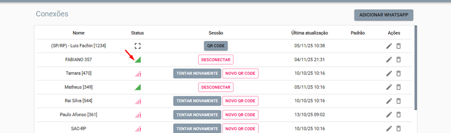

---

### 3.3. Vinculando Usuários às Filas

Para que os vendedores possam acessar e atender as conversas, é necessário vinculá-los às filas.

**Passo 1:** Acesse o menu **"Usuários"**


**Passo 2:** Utilize a barra de pesquisa para localizar o usuário pelo e-mail
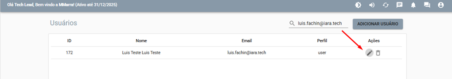

**Passo 3:** Clique no ícone de **edição** (✏️) ao lado do nome do usuário

**Passo 4:** Na janela de edição, localize o campo **"Filas"**
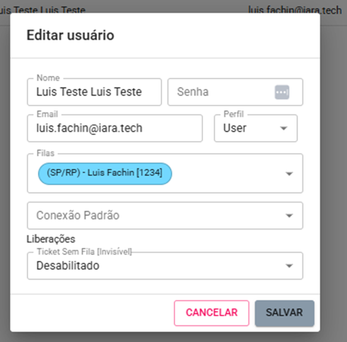

**Passo 5:** Selecione a(s) fila(s) que o usuário terá acesso

:::note Observação
Você pode adicionar múltiplas filas para um mesmo usuário, permitindo que ele atenda diferentes números.
:::
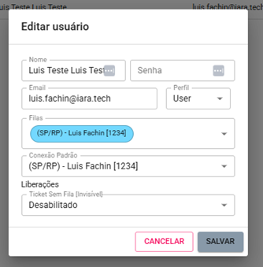

**Passo 6:** No campo **"Conexão Padrão"**, selecione a conexão principal do usuário

**Passo 7:** Clique em **"Salvar"**

---

### 3.4. Atendimento Compartilhado (Múltiplos Atendentes)

Quando você precisa que **vários vendedores ou atendentes** tenham acesso ao mesmo número de WhatsApp, é necessário criar uma fila compartilhada.

#### Como Configurar uma Fila Compartilhada

**Passo 1: Criar a Fila do Departamento**

Acesse **"Filas e Chatbot"** e clique em **"Adicionar Fila"**

Utilize uma nomenclatura que identifique o **departamento ou setor**, não um vendedor específico:

**Exemplos de nomenclatura:**
```
(SP/RP) - SAC
(SP/RP) - Vendas

```

Escolha uma cor identificadora e clique em **"Salvar"**

---

**Passo 2: Conectar o WhatsApp à Fila**

Acesse o menu **"Conexões"** e clique em **"Adicionar WhatsApp"**
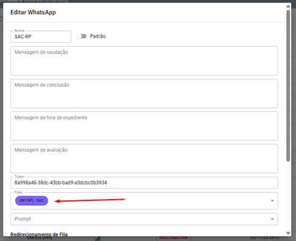

Preencha os campos:
- **Nome:** Utilize o mesmo nome da fila criada (ex: SAC - RP)
- **Fila:** Selecione a fila que você acabou de criar

Após preencher, pressione **ESC** ou clique fora para confirmar

Clique em **"Adicionar"** e depois em **"QR CODE"** para conectar o número de WhatsApp

---

**Passo 3: Vincular os Usuários à Fila Compartilhada**

Agora você precisa adicionar todos os atendentes que terão acesso a este número.

Acesse o menu **"Usuários"**

Para cada usuário que fará parte da equipe:

1. **Pesquise o usuário** pelo e-mail
2. Clique no **ícone de edição** (✏️)
3. No campo **"Filas"**, adicione a fila compartilhada
4. Clique em **"Salvar"**

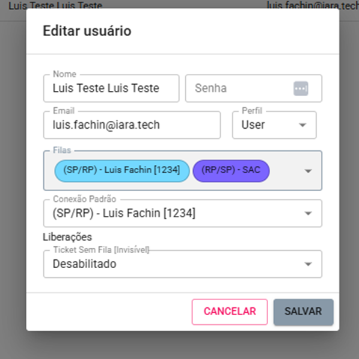

:::info Importante
Você pode adicionar quantos usuários forem necessários à mesma fila. Todos terão acesso simultâneo às conversas.
:::

**Como Funciona na Prática**

Distribuição de Atendimentos::

Quando uma mensagem chega
1.	A conversa aparece em "Aguardando" para todos os usuários vinculados à fila
 
2.	Ao clicar em aceitar, a conversa move-se para "Atendendo" 
3.	A conversa move-se para "Atendendo" 
Exemplo de Fluxo:
Cliente envia mensagem → Aparece para João, Maria e Pedro
→ Maria aceita → Conversa fica com Maria
________________________________________
#### Combinando Filas Individuais e Compartilhadas

Um mesmo usuário pode ter acesso a **múltiplas filas** simultaneamente:

**Exemplo de Configuração:**

**Vendedor: João Silva**
- Fila Individual: (SP/RP) - João Silva \[456\]
- Fila Compartilhada: (SP/RP) - SAC
- Fila Compartilhada: (SP/RP) - Pós-Venda

**Como aparece para João:**

Na interface, ele verá conversas de todas as três filas, diferenciadas pelas cores escolhidas em cada uma.

**Filtro por Fila:**

Use o seletor de filas no topo da tela para visualizar conversas de uma fila específica.
________________________________________


## Utilizando o Sistema de Atendimento

### 4.1. Navegação pela Interface

A tela principal do atendimento está dividida em três seções:


**📬 ABERTAS:** Conversas que aguardam ou estão em atendimento
- **Atendendo:** Conversas que você assumiu e está respondendo ativamente
- **Aguardando:** Conversas novas ou que retornaram e aguardam atendimento

**✅ RESOLVIDOS:** Conversas finalizadas

**🔍 BUSCA:** Ferramenta para localizar conversas específicas por nome, telefone ou conteúdo

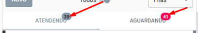
---

### 4.2. Gerenciando Conversas

**Visualizando uma Conversa:**

Você pode abrir uma conversa de duas formas:

1. Clicando no **ícone de olho** (👁️) ao lado do nome do contato
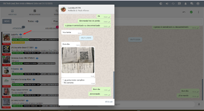
2. Clicando diretamente no **nome do contato**
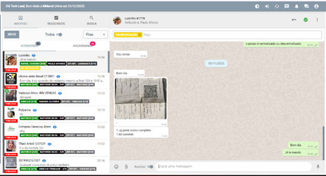

**Ações Principais na Conversa:**
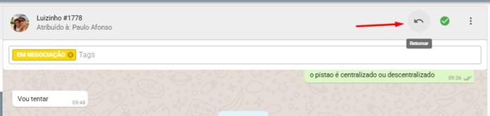

**↩️ Retornar:** Move a conversa de volta para "Aguardando", ideal quando você precisa aguardar resposta do cliente

**✓ Resolvido:** Finaliza a conversa e a move para a seção "Resolvidos"

---

### 4.3. Funcionalidades da Conversa

**Menu de Opções (⋮):**

Ao clicar nos três pontos no canto superior direito, você acessa:
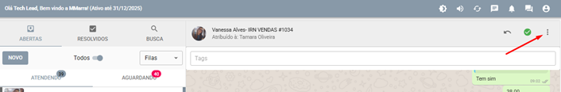

#### 1. Agendamento de Mensagem

Permite programar o envio de uma mensagem para data e hora específicas.

- Selecione o contato
- Digite a mensagem
- Defina data e hora do envio
- Clique em **"Adicionar"**

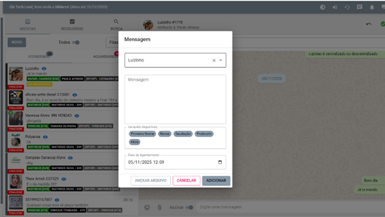

#### 2. Transferir Conversa

Transfere a conversa para outro usuário ou fila.

- Selecione se deseja transferir para uma **fila** ou **usuário específico**
- Escolha o destino
- Clique em **"Transferir"**

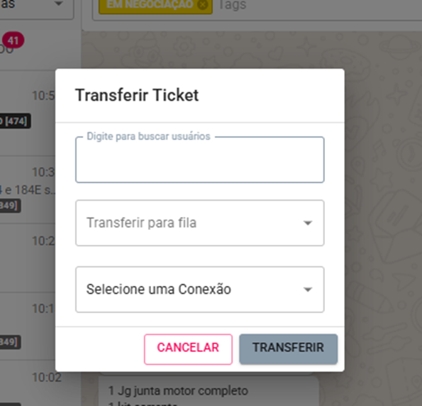

#### 3. Deletar Conversa

Remove permanentemente a conversa do sistema.

:::danger Atenção
Esta ação não pode ser desfeita!
:::

---

**Organizando com Tags:**

As tags ajudam a categorizar e organizar os atendimentos.
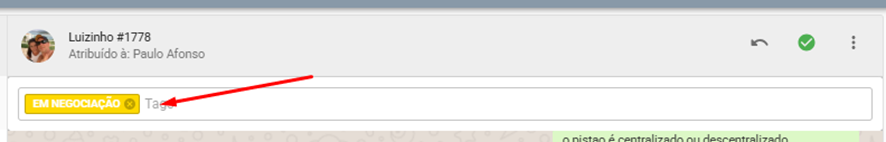
**Como adicionar uma tag:**

1. Clique no campo de tags (abaixo do nome do contato)
2. Digite o assunto da conversa (ex: "Em Negociação", "Orçamento", "Pós-venda")
3. Selecione ou crie uma nova tag

**Tags disponíveis:**
- 2 via Boleto
- Devolução
- Em Negociação
- Garantia
- Marketing
- Nota Fiscal
- RESOLVE
- Resp. Cotação
- Soltar Pedido

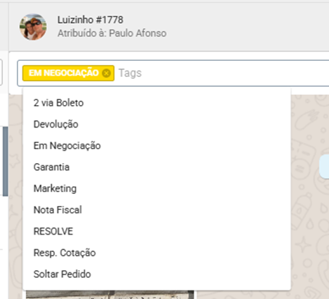
---

**Recursos de Envio:**

Na barra inferior da conversa, você encontra:
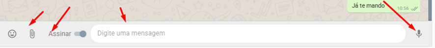

- 😊 **Emoji:** Adicione emoticons às mensagens
- 📎 **Anexo:** Envie arquivos, imagens, documentos ou vídeos
- **@ Marcar seu nome:** Identifica você na conversa ao enviar a mensagem
- ✍️ **Digitar mensagem:** Campo de texto para escrever
- 🎤 **Áudio:** Grave e envie mensagens de voz

---

## Gerenciamento de Contatos

### 5.1. Visualizando Informações do Contato

**Passo 1:** Clique no **nome do contato** no topo da conversa
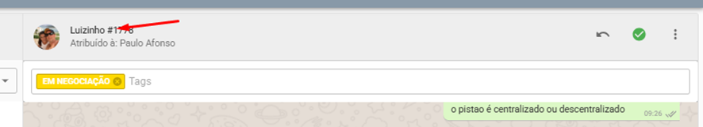

**Passo 2:** O painel lateral exibirá os dados do contato, incluindo:

- Informações básicas (nome, telefone, e-mail)
- Empresas vinculadas
- Observações
- Outras informações relevantes


---

### 5.2. Editando e Vinculando Empresas

**Por que vincular empresas?**

O vínculo entre contato e empresa é essencial para:
- Compartilhar orçamentos diretamente pelo WhatsApp
- Manter histórico organizado de negociações
- Facilitar o acompanhamento comercial

**Como vincular:**

**Passo 1:** Clique em **"Editar Contato"**

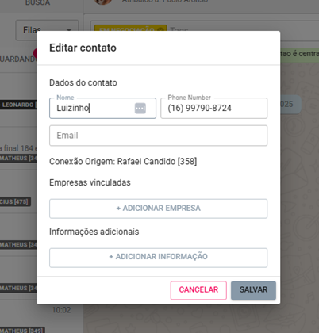

**Passo 2:** Clique em **"+ Adicionar Empresa"**

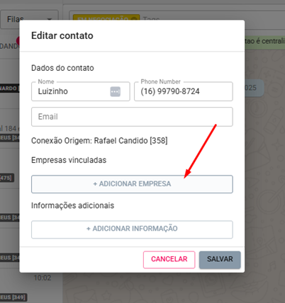

**Passo 3:** Pesquise a empresa por:
- Nome
- Código do cliente
- CPF/CNPJ

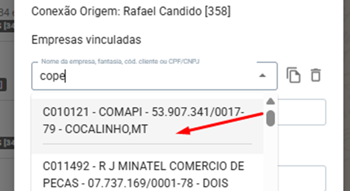

**Passo 4:** Selecione a empresa desejada na lista de resultados

**Passo 5:** Clique em **"Salvar"**

:::tip Dica
Você pode vincular múltiplas empresas ao mesmo contato, útil quando o cliente representa várias razões sociais.
:::

---

## Visualização Kanban

O Kanban oferece uma visão estratégica dos atendimentos organizados por tags.

**Acessando o Kanban:**

Clique no ícone de **Kanban** no menu lateral

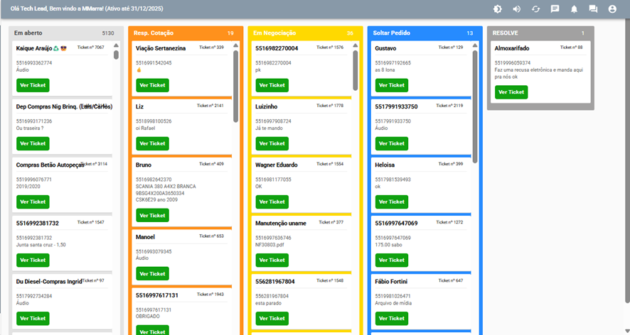

**Benefícios:**

- Visualização clara do pipeline de vendas
- Acompanhamento do status de cada negociação
- Identificação rápida de gargalos no processo
- Gestão eficiente de múltiplos atendimentos

**Como funciona:**

Cada coluna representa uma tag/etapa do processo, e os cartões mostram:
- Nome do contato
- Número do Ticket
- Botão de acesso rápido à conversa

---

## Dúvidas Frequentes

### 1. Não consigo acessar o sistema. O que fazer?

Verifique se está usando as mesmas credenciais do IARA principal. Se o problema persistir, entre em contato com o suporte via Teams: luis.fachin@iara.tech

### 2. O WhatsApp desconectou. Como reconectar?

Acesse "Conexões", localize sua conexão e clique em "Novo QR Code". Escaneie novamente com o WhatsApp do celular.

### 3. Posso atender mais de uma fila simultaneamente?

Sim! Você pode ter acesso a múltiplas filas. Basta que o administrador configure isso na edição do seu usuário.

### 4. Como sei se uma conversa é nova ou retorno?

Conversas novas aparecem em "Aguardando" com destaque. Retornos também ficam em "Aguardando" mas mostram o histórico anterior.

### 5. As tags são obrigatórias?

Não são obrigatórias, mas são altamente recomendadas para organização e geração de relatórios.

### 6. Posso deletar mensagens enviadas?

Não. O sistema registra todas as mensagens para fins de auditoria e histórico comercial.

### 7. Como funciona a transferência de conversas?

Ao transferir, a conversa sai da sua fila e vai para o destino selecionado. O histórico é mantido integralmente.

---

## Boas Práticas de Atendimento

✅ **Responda rapidamente:** Clientes em "Aguardando" devem ser atendidos o mais breve possível

✅ **Use tags consistentemente:** Facilita o acompanhamento e geração de relatórios

✅ **Vincule empresas:** Essencial para envio de orçamentos e histórico comercial

✅ **Finalize conversas:** Marque como "Resolvido" para manter a fila organizada

✅ **Utilize agendamentos:** Programe follow-ups para não esquecer de retornar contatos

✅ **Mantenha observações:** Registre informações importantes no perfil do contato

---

## Suporte Técnico

**Equipe IARA Tech**

📧 **E-mail:** luis.fachin@iara.tech  
💬 **Microsoft Teams:** luis.fachin@iara.tech  