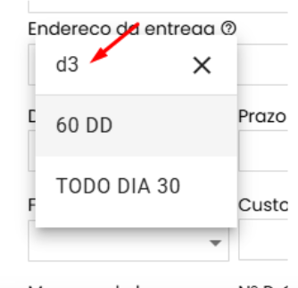
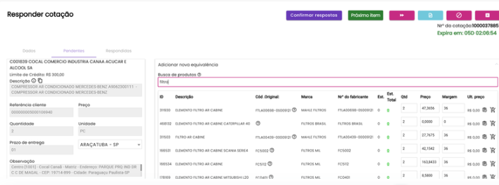
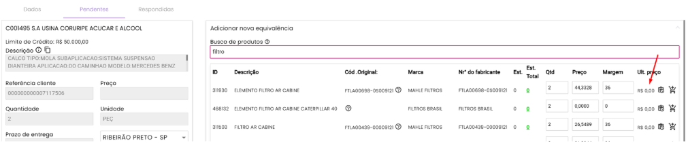
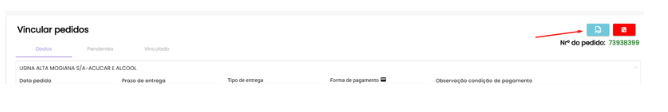

<!-- truncate -->

# Atualização 08/05/2025

## 📚 Sumário

- [🔍 Busca por Condição de Pagamento por Código](#-busca-por-condição-de-pagamento-por-código)
- [🧾 Responder Cotação – Ajustes Comlink](#-responder-cotação--ajustes-comlink)
- [🛠️ Correção na Exibição do “Último Preço”](#️-correção-na-exibição-do-último-preço)
- [🏢 São Martinho – Ajustes na Tela de Cotação](#-são-martinho--ajustes-na-tela-de-cotação)
- [🌐 Responder Cotações do Mercado na Rede (MR) – Etapa 1](#-responder-cotações-do-mercado-na-rede-mr--etapa-1)
- [📄 Pedido – Ajustes Comlink](#-pedido--ajustes-comlink)
- [✅ Finalizar Cotação – Ajuste de Label e Tooltip](#-finalizar-cotação--ajuste-de-label-e-tooltip)

---

## 🔍 Busca por Condição de Pagamento por Código

**Funcionalidade:**  
Permitir que o usuário busque condições de pagamento utilizando o código ERP, mantendo a exibição visual apenas das descrições.

**🎯 Benefícios:**
- ✅ Melhoria na usabilidade: busca rápida por código ERP.
- ✅ Interface mais limpa: exibição apenas da descrição da condição.

---

## 🧾 Responder Cotação – Ajustes Comlink

**Objetivo:**  
Exibir os resultados de equivalência de produtos em formato de **tabela com edição inline**, otimizando a experiência do usuário.

**🎯 Benefícios:**
- 📊 Visualização clara e organizada.
- ✍️ Interatividade com edição direta na tabela.

---

## 🛠️ Correção na Exibição do “Último Preço”

**Correção realizada:**  
O campo **“Último Preço”** agora é corretamente exibido na tela após um pedido recente do cliente, corrigindo o problema anterior de visualização.

---

## 🏢 São Martinho – Ajustes na Tela de Cotação

**Objetivo:**  
Alinhar a experiência de resposta de cotação para a São Martinho ao padrão Comlink.

**📦 Tasks entregues:**
- 🚚 Tipo de entrega carregado automaticamente pela API.
- 💳 Forma de pagamento preenchida com base na API.
- 🛡 Garantia padrão de “3 meses” no cabeçalho.
- 📝 Garantia do item editável manualmente.
- 🏢 Empresa de faturamento respeitada conforme seleção.
- 🧾 Exibição do campo "C" do cliente.
- 📅 Validade da cotação apresentada corretamente.
- 🎨 Layout e fluxo ajustados conforme padrão Comlink.

📌 **Próxima Etapa (Etapa 2):**  
🔁 Automação do envio da resposta do IARA para São Martinho via robô.  
🛠 Desenvolvimento previsto para a próxima sprint.

---

## 🌐 Responder Cotações do Mercado na Rede (MR) – Etapa 1

**Objetivo:**  
Importar automaticamente cotações da plataforma **Mercado na Rede (MR)** para o **IARA**.

**🛠 Tarefas Técnicas Concluídas:**
- ⚙️ Cadastro da integração MR no sistema.
- 👤 Criação de usuário técnico com permissões adequadas.
- 🧩 Serviços desenvolvidos:
  - `ServiceLoginMR` (autenticação)
  - `GetServiceMR` (consumo genérico)
  - `GetQuotationHeader` (importação de cabeçalhos)
  - `GetQuotationDetail` (importação de itens)

⏭️ **Próxima Etapa (Etapa 2):**  
🔜 Criar a interface de **resposta da cotação MR** no IARA com envio das respostas para a plataforma.

---

## 📄 Pedido – Ajustes Comlink

### 📎 Download do PDF do Pedido

**Objetivo:**  
Adicionar botão para baixar o **PDF do Pedido** diretamente no cabeçalho do pedido.

**🎯 Benefício:**  
⏬ Acesso rápido ao documento pelo vendedor.

---

### 🧾 Exibição da Observação da Condição de Pagamento

**Objetivo:**  
Exibir o campo **"PedidoCondicaoPagamento"** no cabeçalho do pedido.

**🎯 Benefício:**  
📋 Consulta fácil da condição de pagamento direto no pedido.

---

## ✅ Finalizar Cotação – Ajuste de Label e Tooltip

**Alterações realizadas:**
- ✏️ Texto alterado para **“Finalizar Cotação”**.
- 💬 Adicionado tooltip explicativo:
  > _“Todos os itens não respondidos até agora serão marcados como ‘Não trabalhamos’.”_

---

